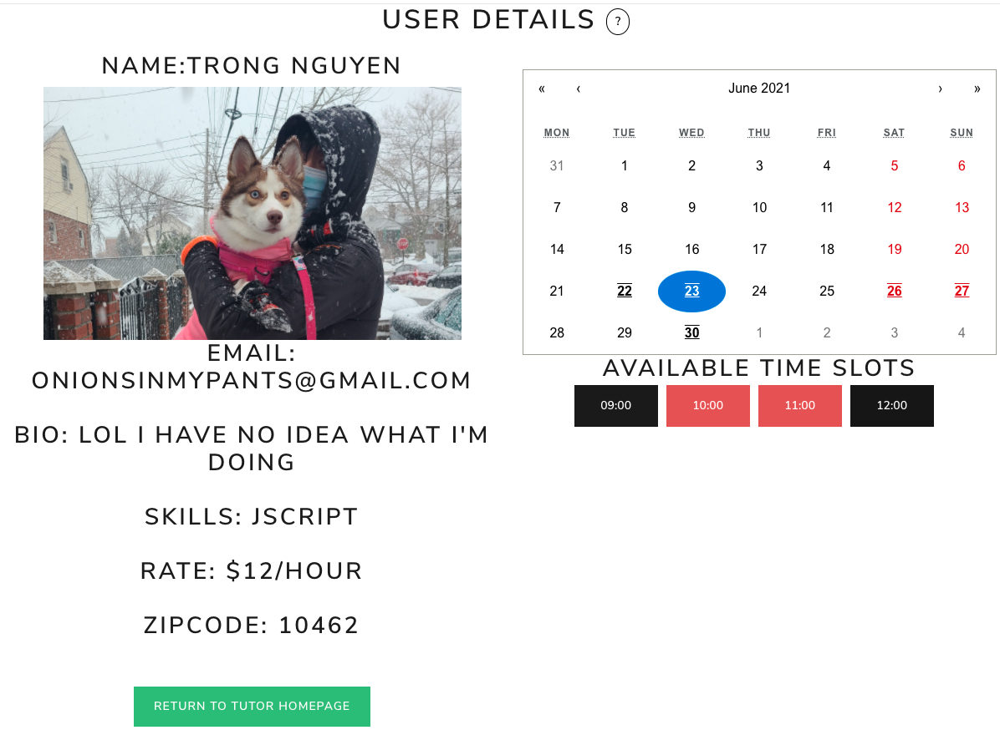

# Coding Tutor

[Click here to launch app!](https://codingtutor.herokuapp.com/)

Are you learning to code and want some help from someone more experienced? Or maybe you are an established programmer wanting to make some money tutoring new learners, either way, Coding Tutor is the choice for you! With the Coding Tutor app you can create an account as a student or tutor, students are able to view tutor profiles and schedule meetings with tutors. Tutors are able to list their skills, such as JavaScript, React, Django, etc., and create time slots for students to schedule meetings.

## Screenshots of the Application:

## Technologies Used:

Python, Django, PostgreSQL, JavaScript, React, CSS, React-Bootstrap

## Links:

[App Deployment](https://codingtutor.herokuapp.com/)

[Trello Board](https://trello.com/b/K6gbDQTo/seir-project-4)

[Pitch Deck](https://docs.google.com/presentation/d/1MCVE9Jj9t-N_N4vKDHXkR5OLRt_zbK8Ha7EI_oQtuno/edit#slide=id.p)

## Next Steps

- [ ] Light & Dark Theme
- [x] Zipcode API
- [x] Wiki Scraper 
    
- [x] Calender Improvements 